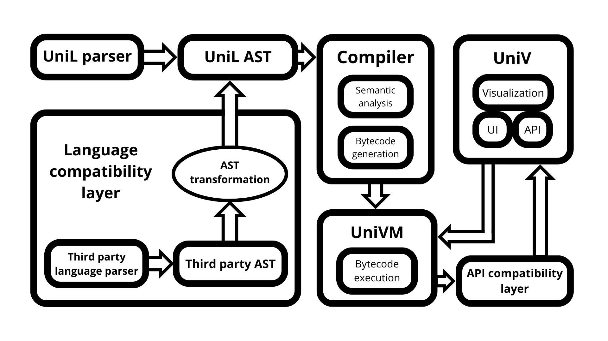

# UniV - The unifying sorting visualization software
UniV aims to be the most feature-rich, easy to use, and compatible sorting visualization software, all while being one of the fastest and most capable.

# What does "UniV" mean?
"UniV" stands for "unifying visualizer" or "universal visualizer". It's a wordplay on ArrayV, the popular sorting visualization program (don't worry, i was involved in its development, so i'm allowed to take inspiration ;3). UniV is "unifying" and "universal", because it's the only currently available visualization software that is able to implement compatibility layers with different programming languages and other visualization software. This means that it's virtually able to run algorithms written in every language, as long as a compatibility layer is written for it. UniV is also the unification of previous experiences in developing similar software, like the old "SortTheater" project, ArrayV, and my [opal Sorting Visualizer, "oSV" for short](https://github.com/amari-calipso/sorting-visualizer), the last one being the greatest ground for experimenting with techniques and approaches. The architecture of UniV's graphics and sound is heavily inspired and influenced by it, so check it out!

# Why UniV?
- UniV is **feature-rich**. It's the most advanced sorting visualization software currently available. It allows for detailed animations with plenty of encodable information, it provides great user interaction, and all of the features from modern visualization programs;
- UniV is **easy to use**, both for users, and programmers. It's specifically designed to have an intuitive interface, and the easiest to use API available. Actually, if you're writing algorithms for UniV, you don't even have to interact with an API at all! Thanks to the dedicated virtual machine, UniV is able to automatically recognize the operations that algorithms perform and visualize them with no further efforts. UniV also tries to be extremely developer-friendly: its code is written to be as simple as possible, and to be built or ran from source without too much of a headache, check it out yourself [here](#run-or-build)!
- UniV is **convenient**. The user interface is designed to be as intuitive as possible, without shoving too many things in front of the user. It has a bunch of quality of life features to make experimentation easier and visualization more enjoyable, and it even provides [an extremely simple custom scripting language for automating visualizations](#the-univ-automation-language), perfect for creating videos without needing to interact with the program, or for creating complex shuffles by combining existing ones!
- UniV is **universal**. As mentioned before, you can run a lot of things on UniV, as long as it has a translation layer for your language and API;
- UniV is **modular**. The architecture is built in such a way that it's easy to add new components to UniV. Want a new visual style? or a new sound system perhaps? a new algorithm? check how easy it is to [add it yourself](#how-to-add-an-algorithm)!
- UniV is **great for creating videos**. Thanks to its integration with [ffmpeg](https://ffmpeg.org/), UniV is able to produce high quality videos without needing any recording software, and without any frame drops, as the video is generated from scratch instead of it being a screen recording;
- UniV loves **open source**. Contributions and forks are more than welcome, and UniV attempts to be as open and accessible as possible for developers.

# Run or build
Note that using render mode requires having [ffmpeg](https://ffmpeg.org/) installed on your machine.

Jump to [releases]() if you just want to use the program! If you're not planning to play around with the algorithms' code, or your machine is not particularly fast, you can download the "lite" version, for a version that's stripped out of the compiler capabilities, hence reducing the hardware requirements significantly.

If you're running or building from source, make sure that your machine has installed:
- [raylib's dependencies](https://github.com/raysan5/raylib/wiki);
- [CMake](https://cmake.org/) (note that release candidate versions, marked as "rc", might not work);
- libclang (if you're on Windows, you can download [LLVM](https://releases.llvm.org/download.html), which contains libclang);

To run or build from source, clone the repository first, then you have two options:
- To run directly, just use `cargo run`.
- To package a release, (a `dist` folder containing the release will be created, note that **any previously existing `dist` folders will be deleted**) run:
    - If building a full release:
        - Unix-like: `rustc dev_util.rs -o dev_util && ./dev_util --release`
        - Windows: `rustc dev_util.rs -o dev_util.exe && dev_util --release`
        - If building a "lite" release:
        - Unix-like: `rustc dev_util.rs -o dev_util && ./dev_util --release-lite`
        - Windows: `rustc dev_util.rs -o dev_util.exe && dev_util --release-lite`

# Architecture


# Documentation
## Table of contents
- [The UniV Automation Language](#the-univ-automation-language)
    - [Syntax](#syntax)
    - [Running an automation](#running-an-automation)
    - [Creating a shuffle by combining existing ones](#creating-a-shuffle-by-combining-existing-ones)
- [UniL: the "core" language](#unil-the-core-language)
    - [Syntax](#syntax-1)
    - [The standard library](#the-standard-library)
    - [Visualizer interaction](#visualizer-interaction)
    - [How to add an algorithm](#how-to-add-an-algorithm)
- [Third party language support](#third-party-language-support)
    - [Python](#python)
        - [What is supported and what is not supported](#what-is-supported-and-what-is-not-supported)
        - [API support](#api-support)
        - [How to add an algorithm](#how-to-add-an-algorithm-1)
    - [Java](#java)
- [Adding visual styles](#adding-visual-styles)
- [Adding sound engines](#adding-sound-engines)
- [Adding API compatibility layers](#adding-api-compatibility-layers)
- [Adding language compatibility layers](#adding-language-compatibility-layers)

## The UniV Automation Language
UniV has a powerful automation system, which allows to create scripts to automatically perform actions, such as selecting a visual style, running an algorithm, changing the visualization speed, and more... 
### Syntax
Scripts are defined using the UniV Automation Language (or UAL).

To run an algorithm, use the `run` statement
```
run distribution "Linear" with length 64
run shuffle "Random"
run sort "Bubble Sort" in "Exchange Sorts"

// you can specify the number of unique items
run distribution "Quadratic" with length 64 and 4 unique
run shuffle "Reversed"
run sort "Sandpaper Sort" in "Exchange Sorts"

// the order of clauses doesn't matter
run distribution "Quintic" with 8 unique and length 64
run shuffle "Sawtooth"
run sort "Insertion Sort" in "Insertion Sorts"
```

Some algorithms require user input, so you can `push` values to a queue to avoid having to input them every time the algorithm runs

```
run distribution "Linear" with length 512
run shuffle "Random"

push 0 // the program would normally ask for buffer size, but this automatically enters "0" in the prompt, without showing it to the user
push "Gries-Mills" // here, the program would ask for a rotation algorithm, which is instead provided here
run sort "Grail Sort" in "Block Merge Sorts"
```

The queue can also be `pop`ped, in case further edits are required
```
push "Hello, World!"
pop // removes the first value from the queue
```

If you decide you want to get rid of all values in the queue, you can `reset` it
```
push 1
push 2
push 3
reset queue
// no value is in the queue
```

It is possible to set a certain visual style within your script
```
set visual "Color Circle"

run distribution "Linear" with length 64
run sort "Bubble Sort" in "Exchange Sorts"
```

And you can also manipulate visualization speed
```
set visual "Bar Graph"

run distribution "Linear" with length 256
run shuffle "Random"
set speed 80
run sort "Bubble Sort" in "Exchange Sorts"
```

You can reset the speed to its default value, if you want
```
set speed 80
reset speed // i changed my mind
```

For convenience, you can also define constants that you can reuse later on
```
define BUBBLE_SORT_SPEED 80

set visual "Bar Graph"

run distribution "Linear" with length 256
run shuffle "Random"
set speed BUBBLE_SORT_SPEED
run sort "Bubble Sort" in "Exchange Sorts"

run distribution "Linear" with length 256
run shuffle "Reversed"
set speed BUBBLE_SORT_SPEED
run sort "Bubble Sort" in "Exchange Sorts"
```

You can also `describe` your automation, to show a summary of what the automation does in UniV's GUI
```
describe "Runs Bubble Sort on 256 random items on the Bar Graph visual style"

define BUBBLE_SORT_SPEED 80

set visual "Bar Graph"

run distribution "Linear" with length 256
run shuffle "Random"
set speed BUBBLE_SORT_SPEED
run sort "Bubble Sort" in "Exchange Sorts"
```

It is possible to use the UniV Automation Language to define integrated procedures, such as Run All Sorts and Run All Shuffles. Check their relative files in the `automations` folder for an example of how they work.

### Running an automation
To run an automation, you can add it to the `automations` folder in UniV. The next time you open the program (or click "Reload algos" in the settings) and open the "Run automation" menu, your automation will be there.

### Creating a shuffle by combining existing ones
Automations can also be useful to combine shuffles together, to create more complex ones

```
run shuffle "Scrambled Tail"
run shuffle "Reversed"
```

This script will first run the "Scrambled Tail" shuffle, and then reverse it, creating a new shuffle which isn't present in the program. To run your shuffle automation, you can just select "Run automation" as a shuffle in any of the menus.

## UniL: the "core" language
UniL is the language native to UniV. You can write algorithms in any supported language, but using UniL will give you the best support.
### Syntax
In UniL, everything is an expression and returns a value.
#### Comments
```
// This is a comment

/*
    This is a multiline comment
    It can't be nested
*/
```
#### Variables
```
a := 0; // := declares a variable. In this context, UniL will infer the variable's type
b: Int := 0; // You can manually specify types

c: any := 0; // If the specified type is "any", the variable will be dynamically typed

// Variables can be reassigned\
a = 1; 
c = "Hello";
```
#### Types
Available types are:
- `any`
- `Int`
- `Float`
- `String`
- `Value` (items in an array created from UniV)
- `List`
- `Object`
- `Null`
- `Bool` (alias of `Int`)
#### Lists
You can create a list using the following syntax
```
myList := [1, 2, 3, "Hello"];
```

To create an array for sorting, use `Array`
```
myArray := Array(10); // Creates an array of 10 elements
```
#### Conditionals
##### If statements
```
if 2 + 2 == 4 {
	a := true;
	if (a) log("True!");
}
```
##### While loops
```
a := 2;
while a-- {
    log("Looping");
}

a = 3;
do {
    log("Looping yet again");
} while a--;
```
##### For loops
```
for i := 0; i < 10; i++ {
    log("This will be printed 10 times");
}
```
##### Foreach loops
```
// 1 2 3
foreach item: [1, 2, 3] {
    log(item); 
}

foreach i: Range(0, 10) {
    log("This will be printed 10 times");
}
```
Foreach loops can iterate any object containing a `next` field, which is a function that takes the object as parameter and returns `any`, or `Null`, when the iteration is finished.

##### Switch statements
```
a := 2;
switch a {
    3 | 4 | 5 {
        log("Nope!");
    }
    2 {
        log("Here!");
    }
    default {
        log("Something else");
    }
}
```
#### Functions
To create a function, you can use the `fn` keyword, like so:
```
fn add(a: Int, b: Int) Int {
    return a + b;
}

fn addAny(a, b) {
    return a + b;
}

fn addNumbers(a: Int | Float, b: Int | Float) Int | Float {
    return a + b;
}

fn sayHello() {
    log("Hello!");
}
```
#### Objects
Objects are created by defining their fields:
```
myObject := #{
    field1: 0,
    field2: "Field 2",
    sayHi: fn _() {
        log("Hi!");
    }
};
```

#### Exceptions
```
fn add(a: Int | String, b: Int | String) Int | String {
    if stringifyType(a) == "String" {
        if stringifyType(b) == "String" {
            return a + b;
        } 
    } else if stringifyType(a) == "Int" {
        if stringifyType(b) == "Int" {
            return a + b;
        }
    }

    throw "Cannot add given values";
}

try {
    a := add(1, "Hello");
} catch {
    log("An error occurred");
}


try {
    a := add(1, 1);
} catch (e) {
    log(e);
}

// using only a try branch will ignore exceptions
try a := add(0, 0);
```
#### Scoped and unscoped blocks
By default, blocks are unscoped, that means that if you define a variable within a block, it will be defined in the function's scope. You can change this behavior by using scoped blocks
```
a := 1;
if a == 1 {
    b := 2;
} else {
    b := 3;
}

// b will be available here

if a == 1 ${
    c := 2;
} else ${
    c := 3;
}

log(c); // Undefined variable
```

#### Main operators
| name | syntax | additional notes |
| ---- | ------ | ----------- |
| Prefix increment | `++x` | Increments `x` before it's used |
| Suffix increment | `x++` | Increments `x` after it's used |
| Prefix decrement | `--x` | Decrements `x` before it's used |
| Suffix decrement | `x--` | Decrements `x` after it's used |
| Negation | `-x` | ... |
| Boolean not | `!x` | ... |
| Bitwise not | `~x` | ... |
| Access | `x.y` | Accesses the `y` property of `x`, where `x` is an Object |
| Addition | `x + y` `x += y` | ... |
| Subtraction | `x - y` `x -= y` | ... |
| Multiplication | `x * y` `x *= y` | ... |
| Division | `x / y` `x /= y` | ... |
| Modulo | `x % y` `x %= y` | ... |
| Shift left | `x << y` `x <<= y` | Shifts `x` left `y` times |
| Shift right | `x >> y` `x >>= y` | Shifts `x` right `y` times |
| Boolean or | <code>x &#124;&#124; y</code> | ... |
| Boolean and | `x && y` | ... |
| Bitwise xor | `x ^ y` `x ^= y` | ... |
| Bitwise and | `x & y` `x &= y` | ... |
| Bitwise or | <code>x &#124; y</code> <code>x &#124;= y</code> | Can define a type group if the operands are types |
| Greater | `x > y` | ... |
| Greater or equal | `x >= y` | ... |
| Less | `x < y` | ... |
| Less or equal | `x <= y` | ... |
| Equality | `x == y` | ... |
| Inequality | `x != y` | ... |
| Ternary | `x ? y : z` | Returns `y` if `x` is truthy, otherwise returns `z` |

### The standard library
The most important functions in the standard library are:
- `swap(List, Int, Int) Null`: swaps two indices in an array;
- `List_push(List, any) Null`: pushes a value to the end of a List;
- `List_clear(List) Null`: removes all elements in a List;
- `List_min(List) any`: returns the minimum item in a List;
- `List_max(List) any`: returns the maximum item in a List;
- `min(any, any) any`: returns the minimum of two values;
- `max(any, any) any`: returns the maximum of two values;
- `log(any) Null`: prints the given object on the console;
- `stringify(any) String`: turns the given object into a string;
- `stringifyType(any) String`: returns a string containing the name of the value type;
- `parseInt(String) Int`: parses an Int from a String. Throws an exception if there is no parsable Int in the String;
- `parseFloat(String) Float`: same as `parseInt`, but with Floats
- `asAny(any) any`: does nothing, can be useful to turn a value into the `any` type at analysis time;
- `int(Int | Float | Value) Int`: casts the given number type into an Int. Throws an exception if the cast is impossible;
- `float(Int | Float | Value) Float`: same as `int`, but with Floats;
- `round(Int | Float | Value) Int`: returns the closest Int to the given value;
- `len(String | List) Int`: returns the length of a String or List;
- `randomInt(a: Int | Value, b: Int | Value) Int`: returns a random Int in range [a, b];
- `randomUniform() Float`: returns a random Float in range [0, 1];
- `math_pow(base: Int | Value | Float, exp: Int | Value | Float) Int | Float`;
- `math_ceil(Int | Value | Float) Int`;
- `math_floor(Int | Value | Float) Int`;
- `Range(a: Int | Value, b: Int | Value) Object`: returns a range object for iterating in the range [a, b);
- `RangeWithStep(a: Int | Value, b: Int | Value, step: Int | Value) Object`: like `Range`, but also accept a step. Instead of advancing iteration by 1, it will advance by `step`;
- `Thread(Callable, List) Int`: creates a Thread given a function and the arguments to pass to it. Returns the Thread ID;
- `Thread_start(Int) Null`: starts a Thread given its ID;
- `Thread_join(Int) any`: waits for a Thread to finish running and returns its output given its ID.

### Visualizer interaction
UniL also provides access to functions to interact with the visualizer
#### Auxiliary arrays
- `Array(Int) List`: returns an auxiliary array of a given size that can be used for sorting;
- `StandaloneArray(Int) List`: like `Array`, but the array will not be added to the visualization;
- `UniV_setNonOrigAux(List) Null`: sets an auxiliary array as "not having original values", that is, it doesn't contain values from the original array. This improves the quality of visuals;
- `UniV_removeAux(List) Null`: removes the given auxiliary array from the visualizer
- `UniV_addAux(List) Null`: adds the given auxiliary array to the visualizer;

#### Manual highlights
- `UniV_immediateHighlight(Int) Null`: highlights the given index immediately, producing a frame;
- `UniV_immediateHighlightAux(Int, List) Null`: like `UniV_immediateHighlight`, but it highlights the given auxiliary array;
- `UniV_immediateMultiHighlight(List) Null`: like `UniV_immediateHighlight`, but with a list of indices;
- `UniV_immediateHighlightAdvanced(Object) Null`: like `UniV_immediateHighlight`, but it highlights an `HighlightInfo` object;
- `UniV_immediateMultiHighlightAdvanced(List) Null`: like `UniV_immediateHighlight`, but it highlights a list of `HighlightInfo` objects;
- `UniV_highlight(Int) Null`: adds the given index to the list of highlights that will be visualized with the next update;
- `UniV_highlightAux(Int, List) Null`: like `UniV_highlight`, but it highlights the given auxiliary array;
- `UniV_multiHighlight(List) Null`: like `UniV_highlight`, but accepts a list of indices;
- `UniV_highlightAdvanced(Object) Null`: like `UniV_highlight`, but uses a `HighlightInfo` object;
- `UniV_multiHighlightAdvanced(List) Null`: like `UniV_highlightAdvanced`, but accepts a list of `HighlightInfo` objects;
- `UniV_markArray(id: Int, index: Int) Null`: marks the array persistently until the end of the current algorithm;
- `UniV_markArrayAux(id: Int, index: Int, aux: List) Null`: like `UniV_markArray`, but it highlights the given auxiliary array;
- `UniV_markArrayAdvanced(id: Int, index: HighlightInfo) Null`: like `UniV_markArray`, but uses a `HighlightInfo` object;
- `UniV_clearMark(id: Int)`: clears a mark precedently set through `UniV_markArray`, given its `id`. Throws an exception if the `id` of the given mark does not exist;
- `UniV_clearAllMarks()`: clears all marks set through `markArray` and related functions.

#### Speed control
- `UniV_setSpeed(Int | Float) Null`: sets the visualization speed to the given value;
- `UniV_resetSpeed() Null`: resets visualization speed to its default;
- `UniV_getSpeed() Float`: returns the current visualization speed. Useful for speed editing;
- `UniV_delay(Int | Float) Null`: sets the delay for the next highlighted operation;

#### Shared algorithms
- `UniV_getPivotSelection(String) Callable`: gets a shared pivot selection algorithm given its name. Throws an exception if the algorithm doesn't exist;
- `UniV_getRotation(String) Object`: gets a shared rotation algorithm given its name. Throws an exception if the algorithm doesn't exist;

#### User input
- `UniV_getUserPivotSelection(String) Callable`: like `UniV_getPivotSelection`, but it asks the user to select a pivot selection algorithm. The parameter is a message to display to the user;
- `UniV_getUserRotation(String) Object`: like `UniV_getRotation`, but it asks the user to select a rotation algorithm. The parameter is a message to display to the user;
- `UniV_getUserSelection(List, String) Int`: asks the user to select between a list of items. Returns the selection index. The string parameter is a message to display to the user;
- `UniV_getUserInput(message: String, default: String, convert: Callable) any`: asks the user to insert some text. The text is then passed to the `convert` callable, to convert it to the desired type. If `convert` fails, the user will be prompted to retry. Returns the converted output. If no conversion is needed, you can pass `asAny`, while if you need to get an Int, use `parseInt`;
- `UniV_popup(String) Null`: shows a popup with a given message to the user; 
- `UniV_pushAutoValue(any) Null`: adds a value to the queue of user input values;
- `UniV_popAutoValue() any`: pops a value from the queue of user input values;
- `UniV_resetAutoValues() Null`: clears the queue of user input values;

#### Invisible operations
- `UniV_invisibleWrite(array: List, index: Int, value: any) Null`: equivalent to `array[index] = value`, but the operation is not visualized;
- `UniV_invisibleSwap(array: List, a: Int, b: Int) Null`: equivalent to `swap(array, a, b)`, but the operation is not visualized;
- `UniV_invisibleRead(array: List, index: Int) any`: equivalent to `array[index]`, but the operation is not visualized;
- `List_invisiblePush(list: List, value: any) Null`: equivalent to `List_push(list, value)`, but the operation is not visualized;

#### Manual statistics editing
- `UniV_addWrites(Int) Null`: adds a given amount of writes to the writes counter;
- `UniV_addReads(Int) Null`: adds a given amount of reads to the reads counter;
- `UniV_addSwaps(Int) Null`: adds a given amount of swaps (and double the amount of writes) to the swaps and writes counters;
- `UniV_addComparisons(Int) Null`: adds a given amount of comparisons (and double the amount of reads) to the comparisons and reads counters;

#### Miscellaneous
- `UniV_immediateSort(List, a: Int, b: Int) Null`: sorts a list from index a to index b (excluding the last element) "immediately", that is, the processing happens in the background, and only a linear pass is visualized. Useful for shuffles or placeholders;
- `UniV_setCurrentlyRunning(String) Null`: sets a custom title for the currently running algorithm;

`HighlightInfo` objects are composed as follows:
```
myHighlightInfo := #{
    idx: 0, // index to highlight
    aux: null, // optional. if set, can be null or an auxiliary array to highlight
    color: Color(255, 0, 0), // optional. if set, contains either null, to indicate the default highlighting color, or a Color object
    silent: false, // optional. if set, can be truthy to indicate that the highlight should not produce sound, or falsey to indicate that it should
    isWrite: true // optional. if set, can be truthy to indicate that this highlight is related to a write operation, or falsey to indicate that it's not
};
```

### How to add an algorithm
#### Shuffles
```
@shuffle { 
    name: "My Shuffle"
}
fn myShuffle(array: List) Null {
    ...
}
```
#### Distributions
Distribution algorithms should produce Ints.
```
@distribution {
    name: "My Distribution"
}
fn myDistribution(array: List) Null {
    ...
}
```
#### Pivot selections
```
@pivotSelection {
    name: "My Pivot Selection"
}
fn myPivotSelection(array: List, start: Int, end: Int) Int {
    // the pivot selection should pick an index in [start, end) 
    // and return it
}
```
#### Rotations
```
@rotation { // alias of @indexedRotation
    name: "My Index-based Rotation"
}
fn myIndexedRotation(array: List, start: Int, middle: Int, end: Int) Null {
    ...
}

@lengthsRotation {
    name: "My Length-based Rotation"
}
fn myLengthsRotation(array: LIst, start: Int, lengthA: Int, lengthB: Int) Null {
    ...
}
```

#### Sorts
```
@sort {
    name:     "My Sort",
    listName: "My Sort",
    category: "Exchange Sorts"
}
fn mySort(array: List) Null {
    ...
}
```

## Third party language support
### Python
#### What is supported and what is not supported
The following Python constructs are not currently supported:
- Keyword parameters
- Variable length parameters
- Default parameters
- Closures
- Most decorators
- Multiple decorators applied to the same definition
- Non-variable for loop targets
- Multiple exception handlers
- Multiple `with` items
- Some `match` patterns
- Non-variable assignment targets in class bodies
- Static methods
- Decorators on classes
- Inheritance
- `global`
- Unpacking
- Slicing
- Matmul operator (`@`)
- `del` of non-variable expressions
- Type aliases
- Imaginary values
- Generators
- List, set, dict comprehensions
- Sets
- `yield`
- `await`
- Formatted strings
- `in`
- Non-string dictionary keys
#### API support
Visualizer interaction in the Python layer usually happens using the [oSV API](https://github.com/amari-calipso/sorting-visualizer), but interacting with the [UniV API](#visualizer-interaction) directly also works.
### Java
Java support is in the works, stay tuned!
## Adding visual styles
Visual styles have to be added from UniV's source code, due to performance constraints. You can add one by creating a file in the `src/visuals` folder, then, create a type that has the same name of the file, but PascalCase (for example: `my_visual.rs` contains `struct MyVisual`). Now you can choose to either manually implement the `Visual` trait on your struct, or use the `visual!` macro to simplify the process. The `Visual` trait provides documentation on what each of the method does.

## Adding sound engines
Sound engines also have to be added from UniV's source code, due to performance constraints. You can add one by creating a file in the `src/sounds` folder, then, create a type that has the same name of the file, but PascalCase (for example: `my_sound.rs` contains `struct MySound`). Now you can choose to either manually implement the `Sound` trait on your struct, or use the `sound!` macro to simplify the process. The `Sound` trait provides documentation on what each of the method does.

## Adding API compatibility layers
See examples of how to add API compatibility layers in `src/api_layers`.

## Adding language compatibility layers
You can add a language compatibiliy layer by creating a file in the `src/language_layers` folder. Inside that file, you can call the `language_layer!` macro to define your compatibility layer. See `src/language_layers/unil.rs` for a basic example. Language compatibility layers work by parsing the language you want to support, and generating a UniL AST, which will then be compiled to bytecode by the rest of the pipeline.
